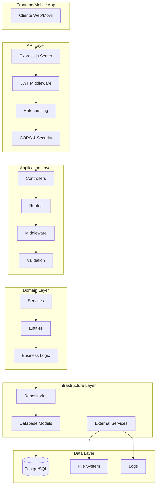
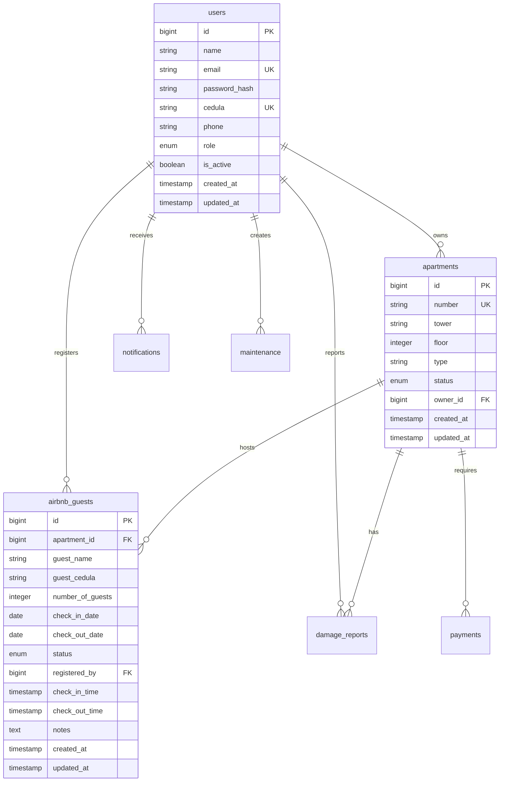

# 🏗️ Arquitectura del Sistema - Conjuntos Residenciales

## 📋 Tabla de Contenidos

1. [Visión General](#-visión-general)
2. [Arquitectura de Alto Nivel](#-arquitectura-de-alto-nivel)
3. [Patrones de Diseño](#-patrones-de-diseño)
4. [Estructura del Proyecto](#-estructura-del-proyecto)
5. [Capa de Dominio](#-capa-de-dominio)
6. [Capa de Aplicación](#-capa-de-aplicación)
7. [Capa de Infraestructura](#-capa-de-infraestructura)
8. [Seguridad](#-seguridad)
9. [Base de Datos](#-base-de-datos)
10. [API y Comunicación](#-api-y-comunicación)
11. [Testing](#-testing)
12. [Despliegue](#-despliegue)

## 🎯 Visión General

El Sistema de Gestión de Conjuntos Residenciales es una aplicación backend desarrollada con **Node.js** y **Express.js** que implementa una arquitectura en capas basada en principios de **Domain-Driven Design (DDD)** y **Clean Architecture**.

### Características Principales
- **API RESTful** completa con autenticación JWT
- **Sistema de notificaciones automáticas** para todos los flujos
- **Gestión multi-rol** (Admin, Owner, Tenant, Security)
- **Base de datos PostgreSQL** con relaciones optimizadas
- **Testing automatizado** con Jest y Supertest
- **Documentación Swagger** completa
- **Logging estructurado** con Winston
- **Configuración de producción** con PM2

## 🏛️ Arquitectura de Alto Nivel



## 🎨 Patrones de Diseño

### 1. **Clean Architecture**
La aplicación separa claramente las responsabilidades en capas:
- **Domain**: Lógica de negocio pura
- **Application**: Casos de uso y orquestación
- **Infrastructure**: Detalles técnicos y frameworks

### 2. **Repository Pattern**
Abstrae el acceso a datos proporcionando una interfaz uniforme:
```javascript
// src/domain/repositories/UserRepository.js
class UserRepository {
    async findById(id) { /* implementación */ }
    async create(userData) { /* implementación */ }
    async update(id, data) { /* implementación */ }
}
```

### 3. **Service Layer Pattern**
Encapsula la lógica de negocio compleja:
```javascript
// src/domain/services/AuthService.js
class AuthService {
    async authenticate(credentials) { /* lógica de autenticación */ }
    async generateToken(user) { /* generación de JWT */ }
}
```

### 4. **Middleware Pattern**
Chain of responsibility para procesar requests:
```javascript
// Autenticación → Autorización → Validación → Controller
app.use('/api/protected', auth, roleAuth, validate, controller);
```

### 5. **Dependency Injection**
Inversión de dependencias para mejor testabilidad:
```javascript
// Controllers reciben servicios inyectados
class AirbnbController {
    constructor(airbnbService, notificationService) {
        this.airbnbService = airbnbService;
        this.notificationService = notificationService;
    }
}
```

## 📁 Estructura del Proyecto

```
residential_complex/
├── 📁 src/                          # Código fuente principal
│   ├── 📁 domain/                   # Capa de dominio (reglas de negocio)
│   │   ├── 📁 entities/             # Entidades del dominio
│   │   ├── 📁 repositories/         # Interfaces de repositorios
│   │   └── 📁 services/             # Servicios de dominio
│   ├── 📁 infrastructure/           # Capa de infraestructura
│   │   ├── 📁 database/             # Configuración y modelos de BD
│   │   ├── 📁 logging/              # Sistema de logging
│   │   ├── 📁 services/             # Servicios de infraestructura
│   │   └── 📁 web/                  # Framework web (Express)
│   │       ├── 📁 controllers/      # Controladores HTTP
│   │       ├── 📁 middleware/       # Middleware de Express
│   │       └── 📁 routes/           # Definición de rutas
│   ├── 📁 shared/                   # Código compartido
│   │   ├── 📁 constants/            # Constantes del sistema
│   │   ├── 📁 errors/               # Manejo de errores
│   │   └── 📁 utils/                # Utilidades generales
│   └── 📄 app.js                    # Configuración principal de Express
├── 📁 database/                     # Scripts de base de datos
│   ├── 📄 init.sql                  # Inicialización de BD
│   ├── 📄 sample_data.sql           # Datos de ejemplo
│   ├── 📄 setup.sh                  # Script de configuración
│   └── 📁 migrations/               # Migraciones de BD
├── 📁 tests/                        # Pruebas automatizadas
│   └── 📁 integration/              # Pruebas de integración
├── 📁 docs/                         # Documentación
│   └── 📁 api/                      # Documentación de API
├── 📁 config/                       # Configuración
├── 📁 scripts/                      # Scripts de utilidad
└── 📄 server.js                     # Punto de entrada
```

## 🏢 Capa de Dominio

### Entidades
Representan los conceptos centrales del negocio:

#### User (Usuario del Sistema)
```javascript
class User {
    constructor(id, name, email, role, cedula) {
        this.id = id;
        this.name = name;
        this.email = email;
        this.role = role; // admin, owner, tenant, security
        this.cedula = cedula;
        this.isActive = true;
    }
    
    hasRole(role) {
        return this.role === role;
    }
    
    canAccess(resource) {
        // Lógica de autorización basada en roles
    }
}
```

#### AirbnbGuest (Huésped Airbnb)
```javascript
class AirbnbGuest {
    constructor(apartmentId, guestName, guestCedula, dates) {
        this.apartmentId = apartmentId;
        this.guestName = guestName;
        this.guestCedula = guestCedula;
        this.checkInDate = dates.checkIn;
        this.checkOutDate = dates.checkOut;
        this.status = 'pending';
    }
    
    checkIn() {
        this.status = 'checked_in';
        this.checkInTime = new Date();
    }
    
    isActive() {
        return this.status === 'checked_in';
    }
}
```

### Servicios de Dominio
Encapsulan lógica de negocio compleja:

#### AuthService
```javascript
class AuthService {
    async authenticate(email, password) {
        // 1. Validar credenciales
        // 2. Verificar usuario activo
        // 3. Generar token JWT
        // 4. Registrar acceso en auditoría
    }
    
    async generateToken(user) {
        // Generación de JWT con claims específicos
    }
}
```

#### NotificationService
```javascript
class NotificationService {
    async notifyAirbnbRegistration(guest, apartment, owner) {
        // Notificaciones automáticas:
        // - Al propietario
        // - Al administrador
        // - A portería
    }
    
    async notifyMaintenanceScheduled(maintenance) {
        // Notificación masiva a todos los residentes
    }
}
```

## 🔄 Capa de Aplicación

### Controladores
Orquestan casos de uso y manejan requests HTTP:

```javascript
class AirbnbController {
    constructor(airbnbService, notificationService) {
        this.airbnbService = airbnbService;
        this.notificationService = notificationService;
    }
    
    async registerGuest(req, res) {
        try {
            // 1. Validar datos de entrada
            // 2. Crear huésped
            // 3. Enviar notificaciones automáticas
            // 4. Retornar respuesta
            
            const guest = await this.airbnbService.register(guestData);
            await this.notificationService.notifyAirbnbRegistration(guest);
            
            res.status(201).json({
                success: true,
                data: guest,
                message: 'Huésped registrado con notificaciones enviadas'
            });
        } catch (error) {
            // Manejo de errores
        }
    }
}
```

### Middleware
Pipeline de procesamiento de requests:

#### Autenticación JWT
```javascript
const authMiddleware = async (req, res, next) => {
    try {
        const token = req.header('Authorization')?.replace('Bearer ', '');
        const decoded = jwt.verify(token, process.env.JWT_SECRET);
        req.user = await User.findById(decoded.id);
        next();
    } catch (error) {
        res.status(401).json({ error: 'Token inválido' });
    }
};
```

#### Autorización por Roles
```javascript
const roleAuth = (...roles) => {
    return (req, res, next) => {
        if (!roles.includes(req.user.role)) {
            return res.status(403).json({ error: 'Permisos insuficientes' });
        }
        next();
    };
};
```

## 🏗️ Capa de Infraestructura

### Base de Datos
Configuración y acceso a PostgreSQL:

```javascript
const sequelize = new Sequelize({
    dialect: 'postgres',
    host: process.env.DB_HOST,
    port: process.env.DB_PORT,
    database: process.env.DB_NAME,
    username: process.env.DB_USER,
    password: process.env.DB_PASSWORD,
    logging: process.env.NODE_ENV === 'development' ? console.log : false
});
```

### Repositorios
Implementación del patrón Repository:

```javascript
class UserRepository {
    async findByEmail(email) {
        return await User.findOne({ where: { email } });
    }
    
    async create(userData) {
        return await User.create(userData);
    }
    
    async findByRole(role) {
        return await User.findAll({ where: { role, isActive: true } });
    }
}
```

### Logging
Sistema estructurado con Winston:

```javascript
const winston = require('winston');

const logger = winston.createLogger({
    level: process.env.LOG_LEVEL || 'info',
    format: winston.format.combine(
        winston.format.timestamp(),
        winston.format.errors({ stack: true }),
        winston.format.json()
    ),
    transports: [
        new winston.transports.File({ filename: 'logs/error.log', level: 'error' }),
        new winston.transports.File({ filename: 'logs/app.log' })
    ]
});
```

## 🔒 Seguridad

### Capas de Seguridad

1. **Network Level**
   - Rate limiting por IP
   - CORS configurado
   - Headers de seguridad (Helmet)

2. **Authentication Level**
   - JWT tokens con expiración
   - Contraseñas hasheadas (bcrypt)
   - Validación de token en cada request

3. **Authorization Level**
   - Control de roles granular
   - Validación de permisos por endpoint
   - Principio de menor privilegio

4. **Data Level**
   - Validación de entrada
   - Sanitización de datos
   - Parámetros preparados (SQL injection prevention)

### Implementación de Seguridad

```javascript
// Configuración de seguridad
app.use(helmet());
app.use(cors({
    origin: process.env.CORS_ORIGIN,
    credentials: true
}));
app.use(rateLimit({
    windowMs: 15 * 60 * 1000, // 15 minutos
    max: 100 // máximo 100 requests por ventana
}));
```

## 🗄️ Base de Datos

### Modelo de Datos



### Índices Optimizados
```sql
-- Índices para consultas frecuentes
CREATE INDEX idx_users_email ON users(email);
CREATE INDEX idx_users_role ON users(role);
CREATE INDEX idx_airbnb_guests_status ON airbnb_guests(status);
CREATE INDEX idx_airbnb_guests_dates ON airbnb_guests(check_in_date, check_out_date);
CREATE INDEX idx_notifications_recipient ON notifications(recipient_id, is_read);
```

## 📡 API y Comunicación

### Estructura de Respuestas
Formato consistente para todas las respuestas:

```javascript
// Respuesta exitosa
{
    "success": true,
    "data": { /* datos de respuesta */ },
    "message": "Operación exitosa"
}

// Respuesta de error
{
    "success": false,
    "error": "Mensaje de error",
    "details": "Información adicional"
}
```

### Documentación Swagger
OpenAPI 3.0 con ejemplos completos:
- Esquemas de datos detallados
- Ejemplos de request/response
- Documentación de autenticación
- Códigos de estado HTTP

## 🧪 Testing

### Estrategia de Testing

1. **Unit Tests**: Lógica de negocio
2. **Integration Tests**: Endpoints completos
3. **Functional Tests**: Flujos de usuario
4. **Authentication Tests**: Seguridad JWT

### Implementación con Jest

```javascript
describe('🏠 Sistema Airbnb', () => {
    beforeAll(async () => {
        // Setup de base de datos de prueba
    });
    
    it('should register guest with notifications', async () => {
        const response = await request(app)
            .post('/api/airbnb/guests')
            .set('Authorization', `Bearer ${ownerToken}`)
            .send(guestData);
            
        expect(response.status).toBe(201);
        expect(response.body.data).toHaveProperty('notifications');
    });
});
```

## 🚀 Despliegue

### Configuración de Producción

#### PM2 Ecosystem
```javascript
module.exports = {
    apps: [{
        name: 'residential-complex',
        script: 'server.js',
        instances: 'max',
        exec_mode: 'cluster',
        env: {
            NODE_ENV: 'production',
            PORT: 3000
        },
        error_file: 'logs/pm2-error.log',
        out_file: 'logs/pm2-out.log',
        log_file: 'logs/pm2-combined.log'
    }]
};
```

#### Docker Support
```dockerfile
FROM node:18-alpine
WORKDIR /app
COPY package*.json ./
RUN npm ci --only=production
COPY . .
EXPOSE 3000
CMD ["npm", "start"]
```

### Monitoreo y Observabilidad

1. **Logging**: Winston con rotación de logs
2. **Health Checks**: Endpoint `/health`
3. **Metrics**: PM2 monitoring
4. **Error Tracking**: Structured error logging

## 📈 Escalabilidad y Performance

### Optimizaciones Implementadas

1. **Database**
   - Índices optimizados
   - Query optimization
   - Connection pooling

2. **API**
   - Rate limiting
   - Response compression
   - Efficient pagination

3. **Security**
   - JWT stateless authentication
   - Middleware caching
   - Input validation

### Consideraciones Futuras

1. **Caching**: Redis para sesiones
2. **CDN**: Para archivos estáticos
3. **Load Balancing**: Multiple instances
4. **Microservices**: Separación por dominio

## 🔄 Patrones de Integración

### Notificaciones Automáticas
Patrón Observer para eventos del sistema:

```javascript
class EventEmitter {
    async emitAirbnbRegistration(guest) {
        // Notificar a múltiples servicios
        await Promise.all([
            this.notifyOwner(guest),
            this.notifyAdmin(guest),
            this.notifySecurity(guest)
        ]);
    }
}
```

### Audit Trail
Registro automático de todas las operaciones:

```javascript
const auditMiddleware = (req, res, next) => {
    const originalSend = res.send;
    res.send = function(data) {
        // Log de la operación
        auditLog.record({
            user: req.user?.id,
            action: req.method,
            endpoint: req.path,
            timestamp: new Date()
        });
        originalSend.call(this, data);
    };
    next();
};
```

---

Esta arquitectura proporciona una base sólida, escalable y mantenible para el sistema de gestión de conjuntos residenciales, siguiendo las mejores prácticas de desarrollo de software moderno.